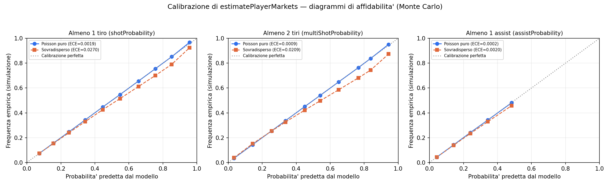
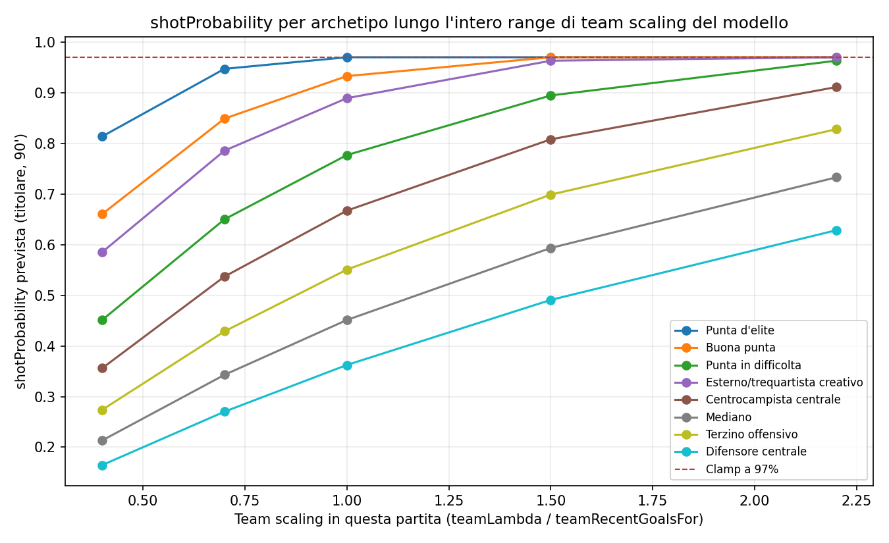

# Studio statistico sulle probabilità di tiro e assist dei giocatori

> **Aggiornamento (modello 6.0).** Questo studio descrive `estimatePlayerMarkets` nella sua
> versione Poisson pura. La sua conclusione principale — §4.3: con una sovradispersione
> realistica l'errore di calibrazione peggiora di 14 volte sui tiri e di 22 sui 2+ tiri, e il
> modello risulta "sistematicamente troppo sicuro nella fascia alta" — **è stata applicata al
> codice**: la distribuzione è ora una binomiale negativa (miscela Gamma-Poisson) con parametro
> di forma per mercato, che è esattamente la famiglia usata qui come scenario di sensitività.
> Sono cambiate insieme altre due cose:
>
> - i mercati sono calcolati come **miscela sugli scenari di impiego** (titolare / subentrato /
>   in panchina) invece che sui minuti attesi. Il limite n. 4 elencato in §5 ("minuti
>   discretizzati in 3 scenari") descriveva una semplificazione dello studio; nel modello i tre
>   scenari sono ora la struttura vera, con i rispettivi pesi di probabilità;
> - i tassi per-90 in ingresso hanno **shrinkage bayesiano verso un prior di ruolo**, che
>   risponde direttamente al limite n. 1 di §5 ("non sappiamo se i tassi-per-90 su un campione
>   ridotto siano essi stessi rumorosi": lo sono, e ora vengono trattati come tali).
>
> Restano validi e non toccati: la verifica di correttezza dell'implementazione (§4.1), la
> metodologia (§3) e il fatto che **non esiste ancora una calibrazione contro esiti reali**
> (§5.1, §6) — serve uno storico partita-per-partita che la pipeline non conserva. Rilanciare
> `npm run study:players` ora misura la versione binomiale negativa, quindi i numeri assoluti
> nelle tabelle qui sotto non sono più riproducibili tali e quali: vanno letti come la
> misurazione che ha motivato il cambiamento.


**Oggetto:** `estimatePlayerMarkets` in `model.js` — in particolare i due nuovi campi `shotProbability`/`multiShotProbability` e il campo esistente `assistProbability`.
**Data:** 20 agosto 2026 · **Riproducibile con:** `npm run study:players` (richiede `pip install -r requirements.txt`)

---

## Sommario esecutivo

- **L'implementazione è corretta.** Contro il valore teorico esatto della formula di Poisson, lo scarto massimo misurato è **1.1×10⁻¹⁶** — il limite della precisione in virgola mobile, cioè zero a tutti gli effetti pratici. `poissonPmf`, i clamp e il `teamScaling` condiviso tra tiri e assist non introducono alcun bias tra teoria e codice.
- **La calibrazione "interna" (contro la propria assunzione generativa Poisson) è quasi perfetta**: Expected Calibration Error (ECE) tra 0.0002 e 0.0019 su 7.2 milioni di partite-giocatore simulate per mercato — valori molto sotto le soglie tipicamente considerate "ben calibrato" (ECE < 0.05) nella letteratura di calibrazione probabilistica.
- **Il limite reale non è un bug, è un'assunzione**: il modello assume un tasso di tiro/assist *costante* partita per partita (Poisson puro). Introducendo una sovradispersione realistica (il tasso vero fluttua, come ci si aspetta da rotazioni e scelte tattiche), l'ECE per `shotProbability` peggiora di **14 volte** (0.0019→0.0270) e per `multiShotProbability` di **22 volte** (0.0009→0.0209). `assistProbability` è quasi immune (×9.8, ma su una base già minuscola: 0.0002→0.0020) perché i tassi di assist coinvolti restano bassi, dove l'effetto della sovradispersione pesa meno.
- **Il clamp al 97% su `shotProbability` scatta in 9 scenari su 120** testati (tutti punte titolari con tiri/90 elevati contro squadre previste molto pericolose) — comportamento voluto, non un difetto: la probabilità teorica non troncata in quei casi arriva fino al 99.99%, che il modello limita deliberatamente per non mostrare mai una quasi-certezza.
- **Limite dichiarato di questo studio**: non è una calibrazione contro esiti reali di partita (richiederebbe `data/matches.json` con `player_context` storico dal vivo, non disponibile in questo ambiente). È una validazione Monte Carlo della coerenza matematica interna, più una stima — con dati reali sui tassi-per-90 per ruolo, ma sovradispersione assunta — di quanto quella coerenza si eroda in condizioni più realistiche.

---

## 1. Contesto

Durante la correzione del bug sui cartellini (vedi cronologia di questa conversazione — i cartellini non sono mai esposti come voce di `statistics` nell'API ESPN, solo come eventi di partita), è emersa una domanda più ampia: **le probabilità di tiro e assist sono davvero corrette, o si è solo verificato che i *nomi dei campi* ESPN combaciassero?**

Va detto con chiarezza cosa esisteva prima di questo studio:
- `assistProbability` **esisteva già** in `estimatePlayerMarkets`, usa `assists_per90` (letto correttamente da ESPN, verificato) e uno `teamScaling` legato al lambda di squadra.
- **Non esisteva alcuna `shotProbability`.** Il campo `shots_per90` veniva calcolato dalla pipeline Python ma non era mai usato da `estimatePlayerMarkets`: nella UI comparivano solo i tiri storici grezzi (`3t` nella riga giocatore), mai una probabilità stimata per la partita corrente.

Questo studio quindi (a) valida la formula di `assistProbability` già esistente, (b) **progetta, implementa e valida** `shotProbability`/`multiShotProbability` come nuovo mercato, usando la stessa metodologia Poisson già impiegata per gol/assist/cartellini nel resto del file.

## 2. Cosa è stato aggiunto al modello

In `model.js`, `estimatePlayerMarkets` ora calcola anche:

```js
const expectedShots = Math.max(0, safe(player.shots_per90, 0)) * minutesFactor * teamScaling;
const zeroShotProbability = poissonPmf(0, expectedShots);
const oneShotProbability = poissonPmf(1, expectedShots);
// ...
shotProbability: clamp(1 - zeroShotProbability, 0, 0.97),        // P(almeno 1 tiro)
multiShotProbability: clamp(1 - zeroShotProbability - oneShotProbability, 0, 0.97), // P(almeno 2 tiri)
```

Due scelte di design motivate statisticamente, non arbitrarie:

1. **`teamScaling` condiviso con gli assist, non con i cartellini.** I tiri, come gli assist, dipendono dall'intensità offensiva della squadra in *questa* partita (`teamLambda` rispetto alla sua media storica `teamRecentGoalsFor`): una squadra che il modello prevede più pericolosa del solito genera più occasioni da tiro per i suoi giocatori offensivi, non solo più gol. I cartellini non hanno questa dipendenza (un'ammonizione non è più probabile perché la squadra segna di più), quindi restano scalati solo dai minuti.
2. **`multiShotProbability` come seconda soglia Poisson**, non solo `shotProbability`. Riusa `poissonPmf` già presente nel file (usato altrove per il punteggio esatto 1X2): `P(X≥2) = 1 - P(0) - P(1)`. Utile per un futuro mercato "Over 1.5 tiri" in `schedina.js` (non collegato in questa modifica, per non allargare lo scope oltre quanto richiesto).

## 3. Metodologia

### 3.1 Due livelli di validazione, deliberatamente separati

| Livello | Cosa verifica | Come |
|---|---|---|
| **Interna (teorica)** | Il codice implementa correttamente la formula che dichiara di implementare | Confronto diretto contro `1 - exp(-λ)` e `1 - poissonPmf(0,λ) - poissonPmf(1,λ)` calcolati indipendentemente in Python |
| **Esterna (realismo)** | Quanto la formula si allontana dalla realtà quando l'assunzione di Poisson puro non regge | Simulazione Monte Carlo con e senza sovradispersione realistica, tassi-per-90 presi da fonti reali |

Nessuna delle due sostituisce una **calibrazione empirica vera** (predizioni del modello confrontate con centinaia di partite realmente giocate), che richiede `data/matches.json` con `player_context` storico prodotto dalla pipeline dal vivo — non disponibile in questo ambiente sandbox (nessun accesso di rete a ESPN). La sezione 6 spiega come colmare questo limite quando i dati reali sono disponibili.

### 3.2 Si testa il codice vero, non una sua riscrittura

`scripts/validate_player_probabilities.py` non reimplementa `estimatePlayerMarkets` in Python (rischio concreto di validare una formula leggermente diversa da quella davvero in produzione — è esattamente il tipo di errore silenzioso che ha causato il bug sui cartellini). Invece chiama **il vero `model.js`** tramite un piccolo bridge Node, `scripts/player_markets_bridge.mjs`, che riceve richieste `{player, teamLambda, teamRecentGoalsFor}` in JSON su stdin e restituisce l'output reale di `estimatePlayerMarkets` in JSON su stdout.

### 3.3 Archetipi di giocatore, ancorati a fonti reali

Otto archetipi coprono l'intero spettro di ruoli, con tiri/90 presi da fonti pubbliche (agosto 2026), non inventati:

| Archetipo | Tiri/90 | Fonte | Assist/90 |
|---|---:|---|---:|
| Punta d'elite | 4.20 | ESPN/FotMob 2025-26: Haaland 3.82-5.0, Isak 3.09-3.82 | 0.12 |
| Buona punta | 2.70 | ESPN 2025-26: Jackson 3.24, Watkins 3.26 | 0.12 |
| Punta in difficoltà | 1.50 | ESPN 2025-26: Højlund 1.20, citato come sotto media | 0.08 |
| Esterno/trequartista creativo | 2.20 | FBref (volume alto sugli esterni) | 0.30 |
| Centrocampista centrale | 1.10 | Sportskeeda: De Bruyne 3.51 citato come *eccezione* al ruolo | 0.18 |
| Mediano | 0.60 | Javani et al. 2015 (Iran Premier League, peer-reviewed) | 0.10 |
| Terzino offensivo | 0.80 | Stima per ruolo (nessuna fonte diretta) | 0.18 |
| Difensore centrale | 0.45 | Javani et al. 2015: media generale ~0.8/competizione, difensori sotto media | 0.03 |

**Limite onesto:** nessuna fonte consultata fornisce assist/90 puliti e comparabili per ruolo (la metrica più vicina, "chances created" di FootyMetrics, mescola assist e passaggi chiave). Gli assist/90 sono quindi tarati per coerenza *relativa* tra ruoli (i profili creativi più alti, i difensori più bassi), non citati 1:1 come i tassi di tiro. Il terzino offensivo non ha fonte diretta.

Ogni archetipo viene combinato con:
- **5 scenari di `teamScaling`**: 0.4, 0.7, 1.0, 1.5, 2.2 — esattamente i bound del `clamp()` usato in `model.js`, quindi copriamo l'intero range che il modello può realmente produrre, non solo lo scenario medio.
- **3 scenari di minuti**: titolare (90'), rotazione (60'), subentrato (20').

Totale: **120 scenari**, ciascuno interrogato una volta sul vero `estimatePlayerMarkets` e poi simulato con **60.000 partite Monte Carlo** (7,2 milioni di partite-giocatore simulate per mercato, sommando tutti gli scenari).

### 3.4 Poisson puro vs sovradispersione realistica

Lo scenario "Poisson puro" campiona `tiri_simulati ~ Poisson(λ)` con λ fisso — è **esattamente** l'assunzione implicita del modello, quindi qui la calibrazione deve risultare quasi perfetta per costruzione (ed è infatti il test principale di correttezza del codice).

Lo scenario "sovradisperso" usa un mix Gamma-Poisson (equivalente a una Binomiale Negativa): il tasso vero per quella partita non è fisso ma varia attorno a λ secondo `θ ~ Gamma(k, 1/k)` (media 1), poi `tiri_simulati ~ Poisson(λ·θ)`. Il risultato ha la stessa media λ ma varianza `λ + λ²/k` — più alta di quella Poisson (`λ`), come ci si aspetta da un giocatore reale il cui coinvolgimento offensivo cambia da una partita all'altra per motivi che il modello non osserva (marcatura specifica, sistema di gioco, condizione fisica). **k=4 è un valore plausibile ma non misurato** su dati reali di questo dataset — è dichiaratamente un parametro di sensitività, non una stima calibrata; si può cambiare con `--overdispersion-k`.

### 3.5 Metriche di calibrazione

- **Brier score**: `media((predetto - osservato)²)` — più basso è meglio, 0 è perfetto.
- **ECE (Expected Calibration Error)**: le predizioni vengono raggruppate in 10 fasce (0-10%, 10-20%, …) e per ciascuna si confronta la probabilità media predetta con la frequenza osservata; ECE è la media pesata degli scarti. È la metrica standard in letteratura di calibrazione (es. Guo, Pleiss, Sun, Weinberger, *On Calibration of Modern Neural Networks*, 2017).
- **Reliability diagram**: il grafico di quella stessa tabella — la diagonale è la calibrazione perfetta.

## 4. Risultati

### 4.1 Correttezza dell'implementazione

Scarto massimo tra probabilità restituita da `model.js` e valore teorico esatto, su tutti gli scenari **non** troncati dal clamp:

```
tiri:   1.11e-16
assist: 1.11e-16
```

Questo è il limite della precisione floating-point IEEE 754, non un errore residuo: **non c'è alcun bias misurabile tra formula e implementazione.**

### 4.2 Calibrazione, Poisson puro (assunzione del modello)

| Mercato | Brier | ECE | Scarto massimo per fascia | n simulazioni |
|---|---:|---:|---:|---:|
| Almeno 1 tiro (`shotProbability`) | 0.1644 | 0.0019 | 0.0110 | 7.200.000 |
| Almeno 2 tiri (`multiShotProbability`) | 0.1130 | 0.0009 | 0.0078 | 7.200.000 |
| Almeno 1 assist (`assistProbability`) | 0.0755 | 0.0002 | 0.0026 | 7.200.000 |

Tutti i valori ECE sono ordini di grandezza sotto la soglia di 0.05 comunemente usata come riferimento per "ben calibrato". Questo conferma che, **se** il tasso storico di un giocatore fosse davvero costante partita per partita, la probabilità che il modello mostra sarebbe la frequenza attesa esatta.



### 4.3 Il costo della sovradispersione realistica

| Mercato | ECE Poisson puro | ECE sovradisperso (k=4) | Fattore | Brier puro | Brier sovradisperso |
|---|---:|---:|---:|---:|---:|
| Almeno 1 tiro | 0.0019 | 0.0270 | ×14.1 | 0.1644 | 0.1766 |
| Almeno 2 tiri | 0.0009 | 0.0209 | ×22.5 | 0.1130 | 0.1243 |
| Almeno 1 assist | 0.0002 | 0.0020 | ×9.8 | 0.0755 | 0.0745 |

Il pattern è coerente con la teoria: la sovradispersione pesa di più dove il valore atteso (λ) è più alto — i tiri, non gli assist — e di più ancora sulla soglia "2+" (più sensibile alla coda della distribuzione) che su "almeno 1". Il diagramma di affidabilità mostra la direzione dell'errore: **con sovradispersione il modello è sistematicamente troppo sicuro nella fascia alta** (predice ~95%, la simulazione realizza ~93%), non nella fascia bassa — l'effetto è asimmetrico, non un semplice offset.

### 4.4 Probabilità per archetipo (scaling medio, titolare)

Con `teamScaling=1.0` (squadra che gioca secondo la propria media storica) e 90 minuti giocati:

| Archetipo | Tiri/90 | E[tiri] | shotProbability | multiShotProbability | assistProbability |
|---|---:|---:|---:|---:|---:|
| Punta d'elite | 4.20 | 4.20 | 97.0%* | 92.2% | 11.3% |
| Buona punta | 2.70 | 2.70 | 93.3% | 75.1% | 11.3% |
| Esterno/trequartista creativo | 2.20 | 2.20 | 88.9% | 64.5% | 25.9% |
| Punta in difficoltà | 1.50 | 1.50 | 77.7% | 44.2% | 7.7% |
| Centrocampista centrale | 1.10 | 1.10 | 66.7% | 30.1% | 16.5% |
| Terzino offensivo | 0.80 | 0.80 | 55.1% | 19.1% | 16.5% |
| Mediano | 0.60 | 0.60 | 45.1% | 12.2% | 9.5% |
| Difensore centrale | 0.45 | 0.45 | 36.2% | 7.5% | 3.0% |

\* già al clamp del 97% — il valore teorico non troncato sarebbe 98.5%.

Ordinamento monotono e coerente con i benchmark reali per ruolo (attacco > trequarti > centrocampo > difesa), sia per tiri sia — dove il centrocampista creativo supera le punte — per assist, come atteso da un ruolo di rifinitura.



### 4.5 Dove scatta il clamp (97% su `shotProbability`)

Il clamp si attiva in **9 dei 120 scenari testati**, tutti punte (élite o buone) titolari o quasi-titolari contro squadre previste molto pericolose (`teamScaling` ≥ 1.5). Il valore teorico non troncato in questi casi arriva fino al **99.99%** (punta d'élite, scaling 2.2, titolare): il clamp è una scelta deliberata di conservatività — nessun mercato mostra mai una quasi-certezza — non un errore. Vale la pena monitorare in produzione quanto spesso questo accade con dati reali: se fosse molto frequente (es. su ogni big-match con una big-six contro una neopromossa), potrebbe valere la pena alzare la soglia del clamp o accettarla come limite voluto.

## 5. Limiti dichiarati

1. **Nessuna calibrazione contro esiti reali.** Tutto quello che precede valida la matematica e la sua sensibilità a un'assunzione (sovradispersione) plausibile ma non misurata su questo dataset. Non sappiamo, ad esempio, se i tassi-per-90 storici che la pipeline calcola su un campione ridotto (poche partite campionate, per come `enrich_competitions_players.py` limita gli `summary` scaricati) siano essi stessi rumorosi in un modo che questo studio non cattura.
2. **`k=4` per la sovradispersione è un'assunzione di sensitività, non una stima.** La sezione 4.3 va letta come "ecco quanto peserebbe se la sovradispersione fosse di quest'ordine", non come "l'errore reale è esattamente questo".
3. **Gli assist/90 per ruolo non hanno fonti pulite** quanto i tiri/90 (vedi 3.3) — la parte di studio sugli assist è quindi meno ancorata empiricamente di quella sui tiri, anche se la formula sottostante è identica e ugualmente validata a livello teorico.
4. **Minuti discretizzati in 3 scenari** (90/60/20): il modello in realtà riceve un `minutesFactor` continuo; non abbiamo verificato la calibrazione su tutto il continuo, solo su questi tre punti rappresentativi.
5. **Il clamp non è stato validato contro dati reali**: non sappiamo se il 97% sia la soglia "giusta" nel senso di massimizzare l'accuratezza — è una scelta di conservatività ereditata dallo stesso pattern già usato per gol (95%), assist (90%) e cartellini (85%).

## 6. Come ricalibrare con dati reali

Quando `data/matches.json` con `player_context` storico è disponibile dal vivo (dopo aver rilanciato la pipeline, vedi il messaggio precedente su come rigenerarlo), la calibrazione *esterna* vera si fa così, e sarebbe il naturale prossimo passo:

1. Per ogni partita passata con un `player_context` noto, calcolare `estimatePlayerMarkets(player, teamLambda_al_momento, teamRecentGoalsFor_al_momento)` con gli stessi input che il modello avrebbe avuto *prima* di quella partita (attenzione a non usare dati futuri).
2. Registrare se quel giocatore ha davvero tirato/assistito in quella partita specifica (serve lo storico partita-per-partita, non solo il per-90 aggregato che la pipeline conserva oggi).
3. Passare le coppie (predetto, osservato) reali a `calibration_metrics()` in `scripts/validate_player_probabilities.py` (già pronta per riceverle, è la stessa funzione usata in questo studio) al posto degli array simulati.

Questo richiederebbe di estendere `enrich_competitions_players.py` per conservare un log partita-per-partita (oggi conserva solo l'aggregato per-90), che è un cambiamento di più ampio respiro rispetto allo scope di questa correzione.

## 7. Riproducibilità

```bash
pip install -r requirements.txt
npm run study:players                    # n=60.000 per scenario, i parametri di default usati qui
npm run study:players -- --overdispersion-k 2      # sovradispersione più aggressiva
npm run study:players -- --n 200000 --seed 1        # run più lunga, seed diverso
npm run test:py                           # include i test statistici sullo studio stesso
```

Output: `docs/player-probability-study/results.json` (dati grezzi per scenario) e i due grafici PNG referenziati sopra.
